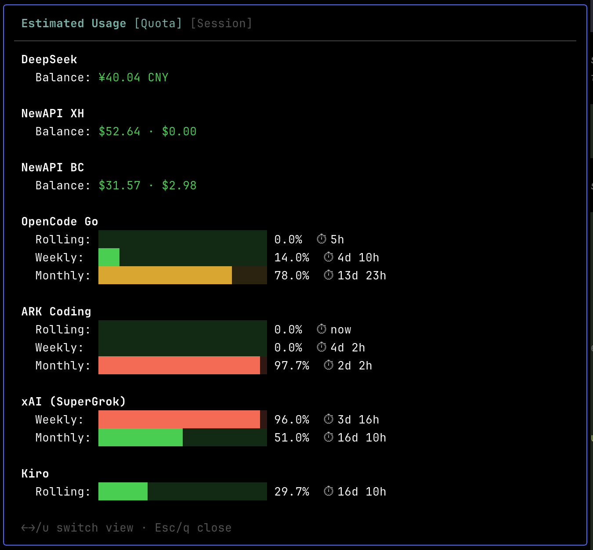
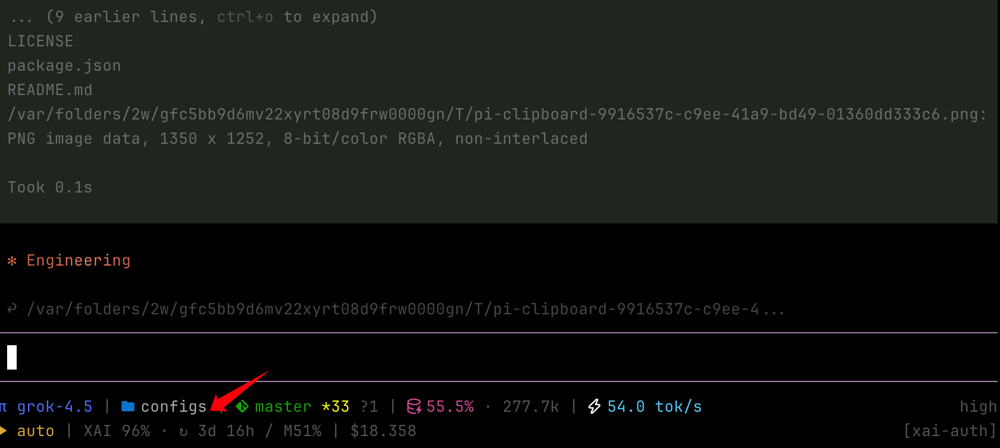

# pi-usage-hub

**Track provider quotas and balances in pi — `/usage-hub` panel, session stats, and a pull API for footer integration.**

[](https://www.npmjs.com/package/pi-usage-hub)
[](https://opensource.org/licenses/MIT)

## Why

Checking separate dashboards for DeepSeek, NewAPI relays, xAI, Kiro, OpenCode Go, and ARK breaks flow. pi-usage-hub brings their quotas and balances into one TUI panel while keeping footer integration optional and pull-based.

## Install

```bash
pi install npm:pi-usage-hub
```

## Commands

| Command | Description |
|---------|-------------|
| `/usage-hub` | Show quotas and balances for detected providers |
| `/usage-hub session` | Show local session token and cost stats |
| `/usage-hub login <name>` | Open browser login for a cookie-based provider |

Inside the panel, **Tab** switches between Quota and Session.



## Configuration

Create `~/.pi/agent/pi-usage-hub.json`. Provider order is preserved in the panel.

```json
{
  "providers": [
    {
      "type": "deepseek",
      "apiKey": "sk-..."
    },
    {
      "name": "xh",
      "type": "newapi",
      "matchProviders": ["xh-cc", "xh-glm"],
      "host": "https://example.com",
      "token": "...",
      "userId": "1"
    },
    {
      "name": "ocg",
      "type": "opencode-go",
      "workspaceId": "wrk_...",
      "matchProviders": ["opencode-go"]
    },
    { "type": "ark" },
    {
      "type": "xai",
      "matchProviders": ["xai-auth", "xai", "grok-cli"]
    },
    { "type": "kiro" }
  ]
}
```

### Common fields

| Field | Required | Description |
|-------|----------|-------------|
| `type` | yes | Built-in provider factory |
| `name` | no | Instance key; defaults to `type`, then `type-2`, `type-3`, and so on |
| `matchProviders` | no | Additional `model.provider` values mapped to this entry |
| `shortLabel` / `label` | no | Override the footer label or panel title |

### Provider types

| Type | Credentials | Notes |
|------|-------------|-------|
| `deepseek` | `apiKey` | Account balance |
| `newapi` | `host`, `token`, `userId` | Balance and today's spend; supports multiple instances |
| `opencode-go` | `workspaceId`; optional `auth` | Uses the configured auth cookie or macOS Chrome |
| `ark` | optional `cookie`, `csrfToken` | Uses the configured Cookie header or macOS Chrome |
| `xai` | — | Reads `auth.json` or `~/.grok/auth.json` |
| `kiro` | — | Reads the Kiro OAuth entry from `auth.json` |

For NewAPI, `token` is the **system access token** (not a chat `sk-` token), and `userId` is sent as `New-Api-User`. See [Authentication](https://www.newapi.ai/en/docs/api/management/auth) and [Generate access token](https://www.newapi.ai/en/docs/api/management/user-management/user-token-get).

For ARK and OpenCode Go, configured `cookie` / `auth` values take priority over Chrome. Manual credentials disable `/usage-hub login` for that entry; replace them when they expire. Automatic Chrome cookie reading is **macOS only**.

### Related auth packages

These are companion packages, not npm peer dependencies:

| Type | Companion | Purpose |
|------|-----------|---------|
| `xai` | [`pi-xai-oauth`](https://www.npmjs.com/package/pi-xai-oauth) | `/login xai-auth` writes the OAuth entry to `auth.json` |
| `kiro` | [`pi-provider-kiro-dev`](https://www.npmjs.com/package/pi-provider-kiro-dev) | Provides `/login kiro`, models, and the `auth.json` entry |

pi-usage-hub only reads those credentials; it does not run their OAuth flows.

Built-in providers are the ones already used and smoke-tested by the author. The provider ecosystem is too broad to cover exhaustively. Add another provider through L2 registration, or fork the package and submit a PR.

## Pull API

The hub caches results for 60 seconds and deduplicates concurrent requests. It never pushes footer text: consumers start refreshes without blocking lifecycle events, read the cached summary, and re-render when notified.

| API | Role |
|-----|------|
| `pi-usage-hub:ready` | Provides the hub; also emitted on `session_start` |
| `hub.refresh({ model?, force? })` | Refreshes the matching provider and returns its summary |
| `hub.getSummary(model?)` | Synchronously reads the cached one-line summary |
| `pi-usage-hub:updated` | Signals `{ key, summary }` after a cache update |

### Footer example



```ts
type UsageHub = {
  getSummary(model?: { provider?: string }): string | null;
  refresh(opts?: {
    model?: { provider?: string };
    force?: boolean;
  }): Promise<string | null>;
};

let usageHub: UsageHub | null = null;
let requestRender: (() => void) | null = null;

const offReady = pi.events.on("pi-usage-hub:ready", (hub: UsageHub) => {
  usageHub = hub;
  requestRender?.();
});

const offUpdated = pi.events.on("pi-usage-hub:updated", () => {
  requestRender?.();
});

// Pi awaits lifecycle handlers; refresh in the background and re-render on pi-usage-hub:updated.
pi.on("session_start", (_event, ctx) => {
  void usageHub?.refresh({ model: ctx.model, force: true });
});
pi.on("model_select", (event) => {
  void usageHub?.refresh({ model: event.model, force: true });
});
pi.on("agent_end", (_event, ctx) => {
  void usageHub?.refresh({ model: ctx.model, force: true });
});

// Inside footer render():
// const usageText = usageHub?.getSummary(ctx.model);
// "XAI 87% · ↻ 3d 16h / M48%"

pi.on("session_shutdown", async () => {
  offReady();
  offUpdated();
  usageHub = null;
});
```

### L2 provider registration

See [`examples/custom-provider.ts`](./examples/custom-provider.ts) for a self-contained extension that implements and registers a provider. Copy it into `~/.pi/agent/extensions/`, then adapt the endpoint, credentials, response shape, and labels.

```ts
pi.events.on("pi-usage-hub:ready", (hub) => hub.register(myProvider));
pi.events.emit("pi-usage-hub:register", myProvider);
pi.events.emit("pi-usage-hub:unregister", { key: "my-relay" });
```

## License

MIT
